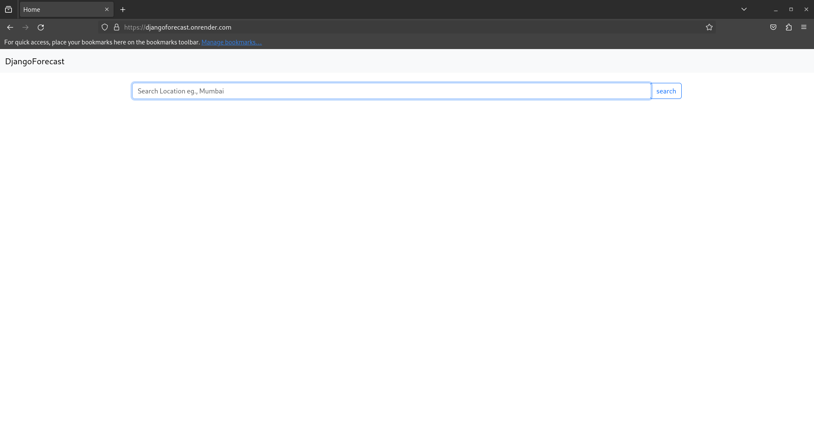
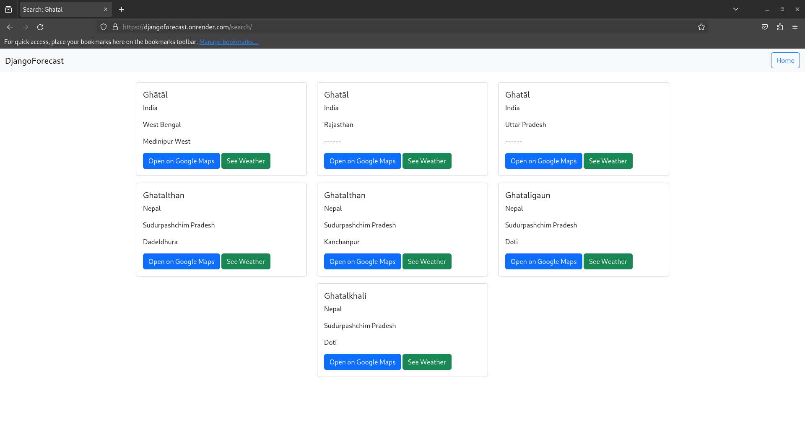
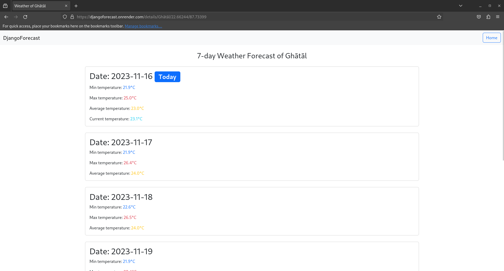

# DjangoWeatherForecast

DjangoWeatherForecast is a web application that provides a 7-day weather forecast based on user location input. The application is built using Django, integrating geocoding and weather forecast APIs.

## Features

- Search for locations to view their 7-day weather forecast.
- Display minimum, maximum, and average temperatures for each day.
- Highlight current temperature if viewing today's forecast.

## Deployment

The application is deployed on Render and can be accessed at [DjangoWeatherForecast](https://djangoforecast.onrender.com).

## Getting Started

To run the project locally, follow these steps:

1. Clone the repository:

   ```bash
   git clone https://github.com/your-username/DjangoWeatherForecast.git
   pip install -r requirements.txt
   python manage.py migrate
   python manage.py runserver
   ```
The application will be accessible at http://localhost:8000.

Dependencies
Django
Requests (for API communication)
Bootstrap (for styling)

 
 
 
 
 
